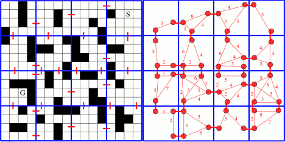

[< back](../homepage.html)

# Notes on _Clearance-based Pathfinding and Hierarchical Annotated A* Search_

This page is a summary of my notes from Daniel Harabor's essay, [_Clearance-based Pathfinding and Hierarchical Annotated A* Search_](https://web.archive.org/web/20190411040123/http://aigamedev.com/open/article/clearance-based-pathfinding/).

tl;dr: In some cases, hierarchical pathfinding can be used to speed up the pathfinding processes without significant error. The hierarchy consists of general or abstract decisions derived from the true decision space.

Here is an example of a maze and a simplified graph which provides equivalent pathfinding ability:
