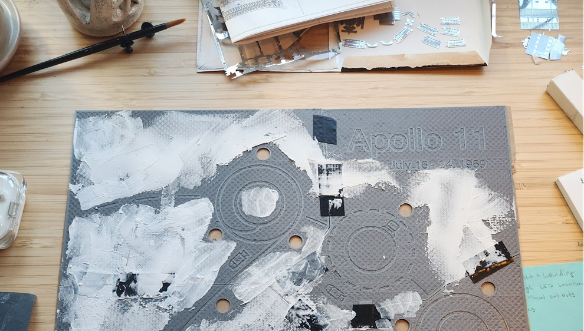
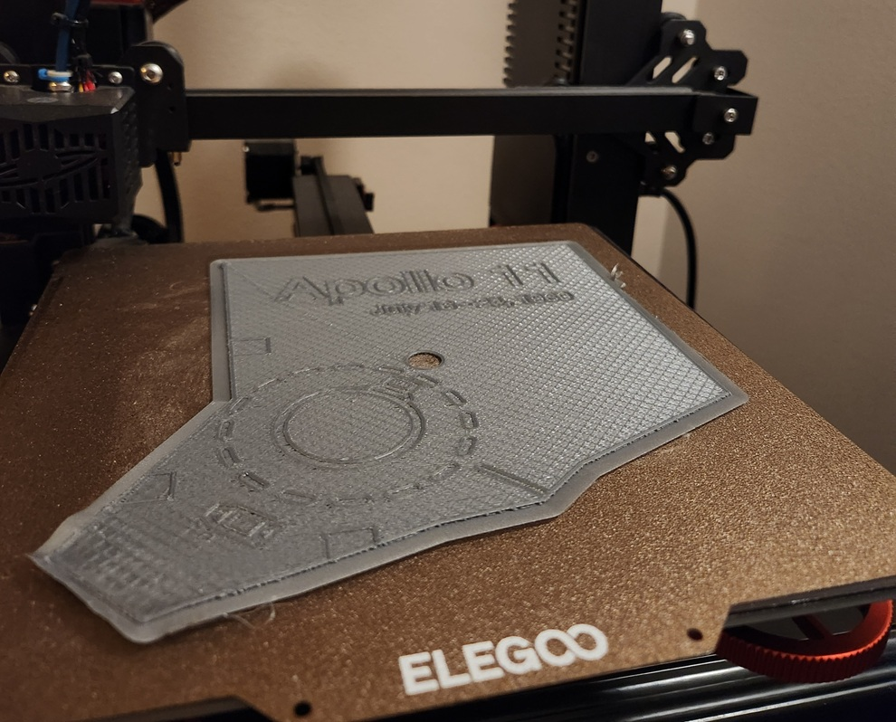
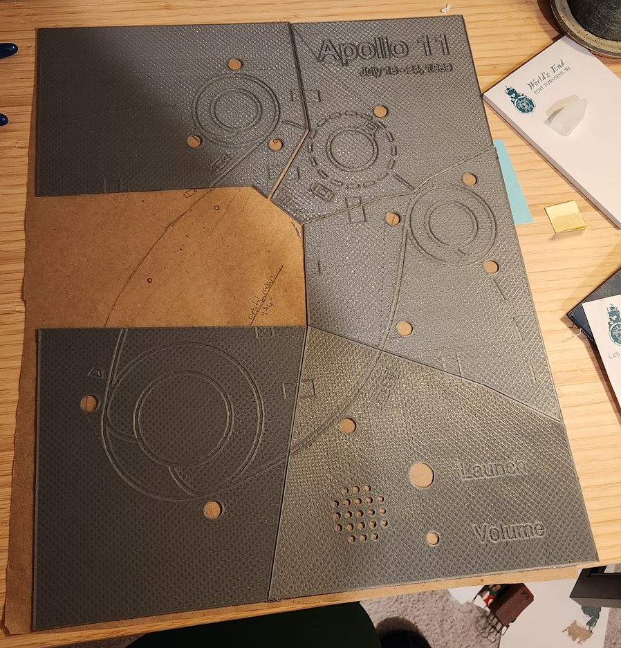
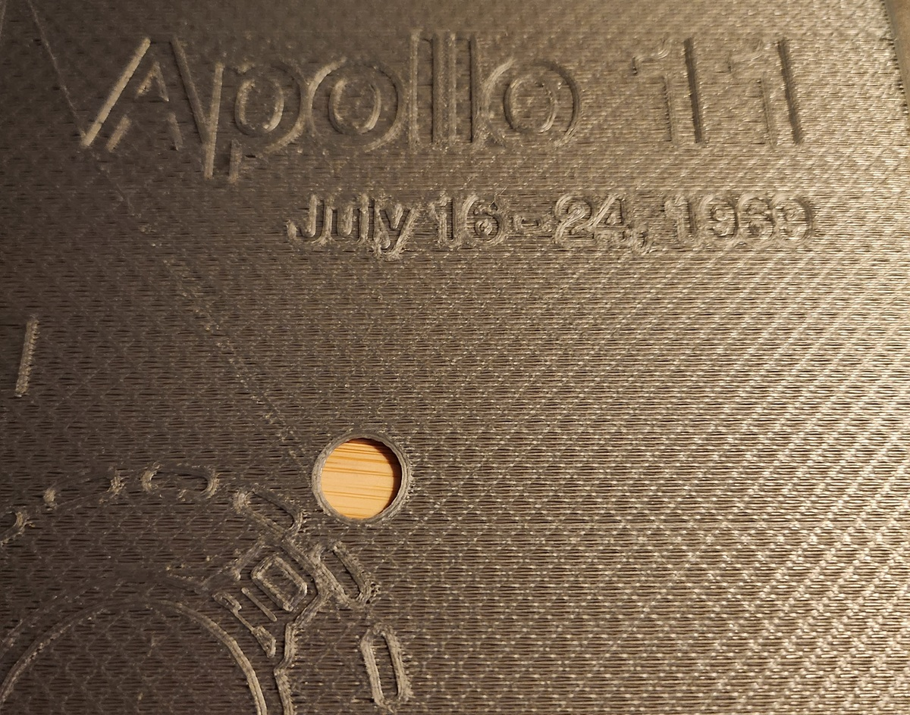
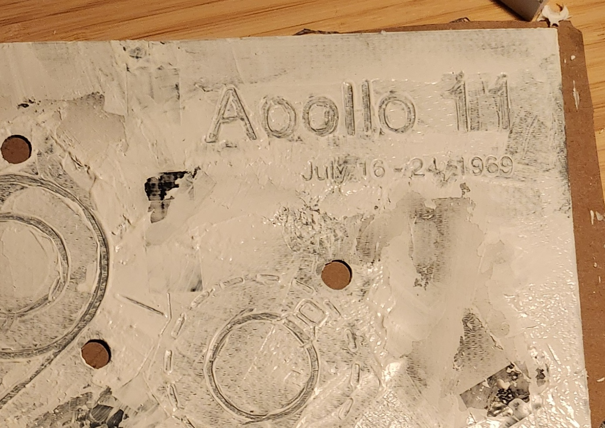
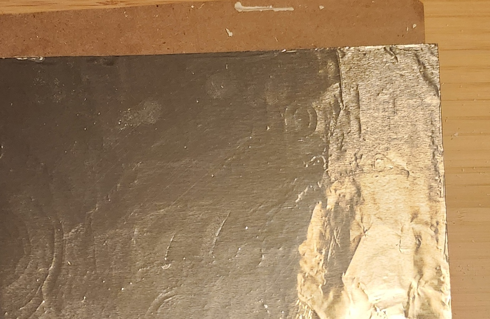
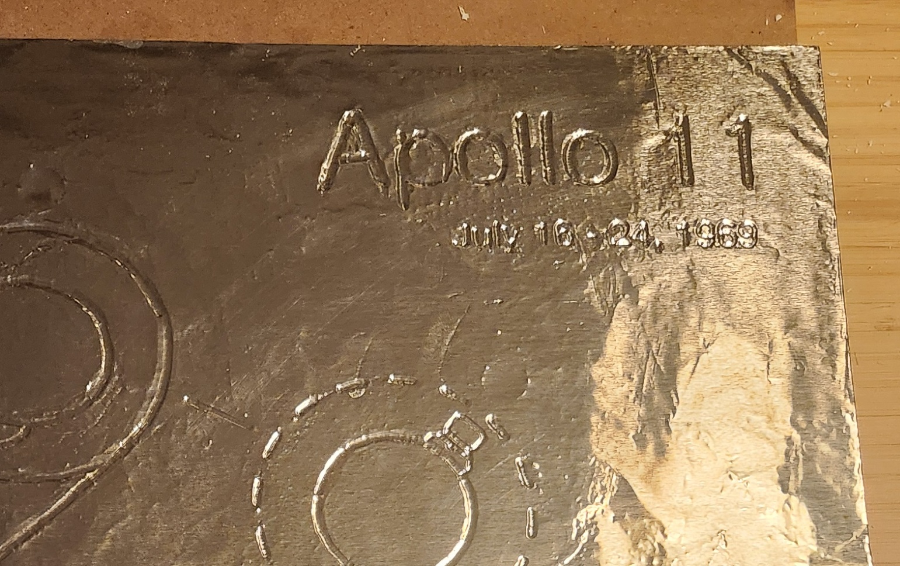
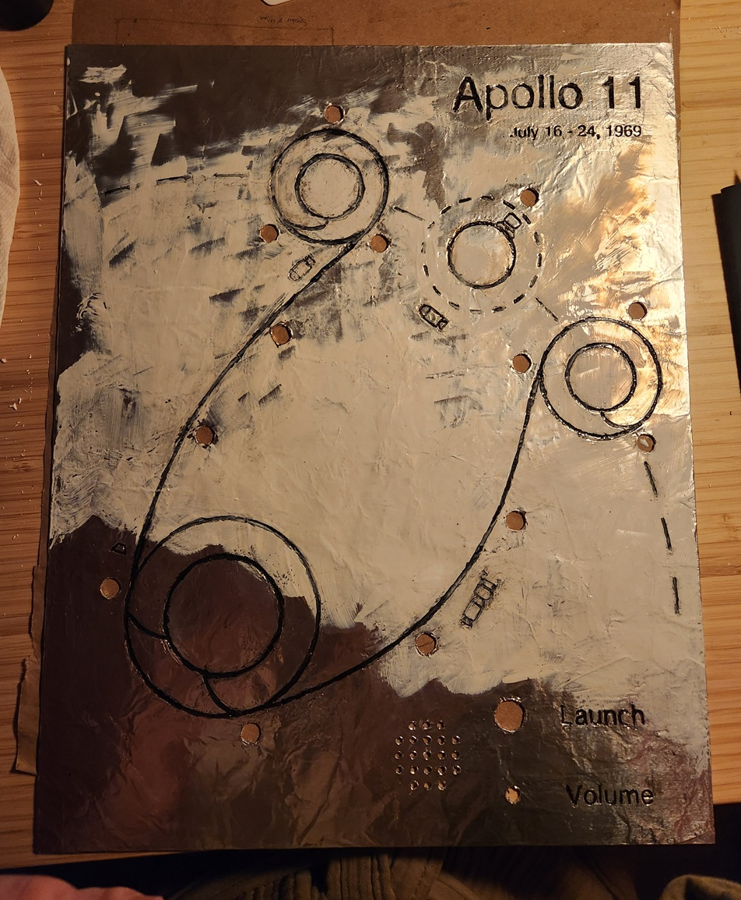
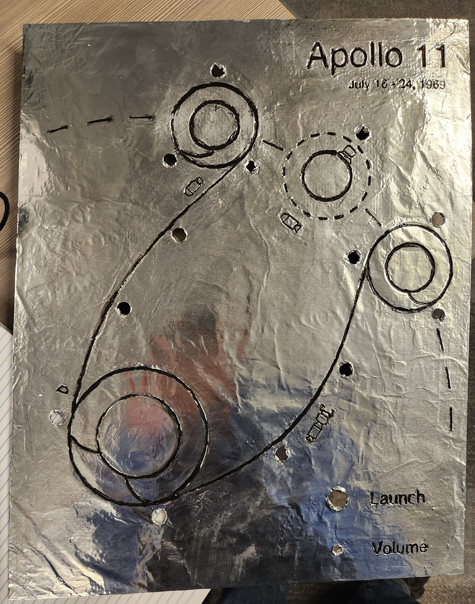

[< back](./index.html)

# The Apollo Project

I am building a diagram of the flight path of Apollo 11. LEDs track the movement of the spacecraft in real time and blink to indicate moments of interest. You can also listen to the communications between the command module and ground control. A knob will allow for volume control and a button will cue to 'launch' the mission. I've been working on this project intermittently over the past year or two. 

The main panel is 3D printed, smoothed with an acrylic medium, covered with aluminum foil, and the grooves are inlaid with black paint. An ESP32 microcontroller lies in its gut, reluctantly programmed in C++. 

The circuit still lives on a breadboard, but is mostly done. After wrapping up a few final details, I'll start soldering the final board and building a frame for the whole thing.

# The Audio
           
The audio for this project was manually scraped from the [Apollo in Real Time](https://apolloinrealtime.org/11/) project. The team behind this project started with rough copies of the original audio, and made it sound remarkably clean. I did some additional work in Audacity, but my contribution is negligible.

In total, there are about 200 hours of audio.

# The Panel

## Design
           
After a handful of thumbnail sketches and test 3d prints, I made a to-scale drawing on butcher paper and finalized the size and layout of various elements.

## Printing
           

I used Fusion360 to model the panels. Working in batches (and certainly without best practices in mind), I would draw a portion of the lines, and extrude them into recessions. The icons of the spacecraft were a particular pain. Not knowing how to reuse geometry, each was made from scratch. When everything looked good, I split it into six pieces so that it could fit on my 3d printer.

## Connecting
           

My original plan for connecting the pieces was for them to be connected with small rectangular tabs, which would fit into recesses. Frankly, this didn't work at all, but electrical tape worked great.

## Smoothing
           

My 3d printer is budget level, so the prints have a rough texture. After trialing several materials, I decided on using a thick acrylic paint medium to smooth the surface. It spreads easily without flowing like paint, doesn't shrink as it dries, and can take a smooth finish.

## Foiling
           

Once smoothed and lightly sanded, I covered the entire thing in Mod Podge glue, and laid a sheet of Costco-sized aluminum foil over top. Once dried, I used the back of a paintbrush to lightly push the foil into the grooves. To my surprise, the foil moved easily and never tore.

## Inking
           
I mixed my best black paint and Mod Podge to get a black paste, and used that to fill in the grooves. I would messily paint over the lines, then wipe away the excess on the raise surfaces.

A few thoughts of hindsight here:
* Using a cheaper, less pigmented paint would have aided in wiping up the excess paint
* Dried paint can be scraped away, allowing more touch ups. Dried Mod Podge is hard and is very difficult to scrape. The quality of some of the lines suffered from not being able to clean them up.

## Sealing
           

To prevent any scuffs of the ink, or tearing of the foil, I covered it with one last layer of Mod Podge.

# The Circuit
           
The circuit currently sits on my workspace as a mess of wires bouncing around a few breadboards. There are a few more additions to the code before I start soldering everything together.

# The Frame
           
I've barely even thought about the frame so far. 😁
